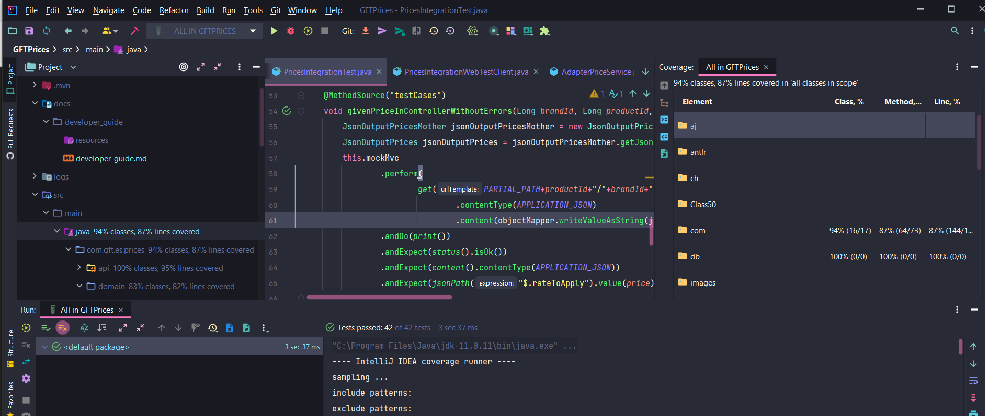
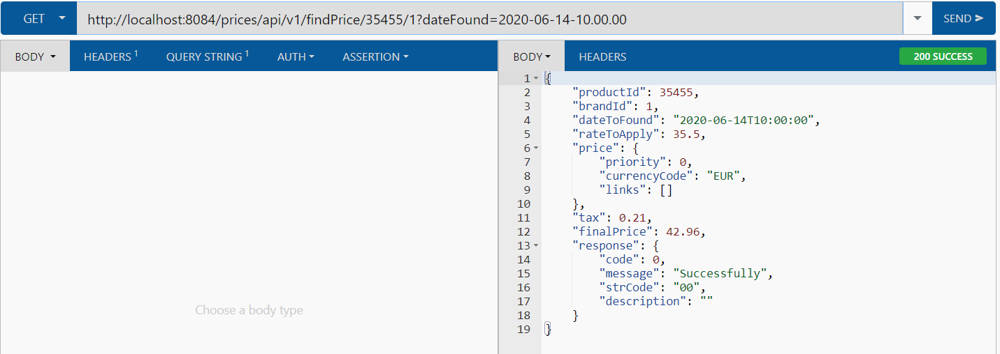

# Price Message Service Test  
#System Documentation Prices

The purpose of these documents is to provide an overview of the post system to a developer. It is assumed that the reader has a minimal understanding how the pricing microservice works, knowing that the data of product and brands come from other microservices and a system developer knowledge.


| Writer                | Date       | Version |
| :-------------------- | :--------: | ------: |
| Susana Galán         | 11/01/2023 | 1.0     |
| :-------------------- | :--------: | ------: |
| Susana Galán         | 23/01/2023 | 2.0     |

## Index
- [Payments Operation System Documentation](#payments-system-documentation)
    - [Index](#index)
    - [Overview](#overview)
    - [Swagger Documentation](#swagger-documentation)

## Overview

A microservice was built in SpringBoot that has a query rest end point that accepts as input parameters: 
the product identifier, the brand identifier and the application date.

With the following format of example.

http://localhost:8084/prices/api/v1/findPrice/35455/1?dateFound=2020-06-14-10.00.00

It returns as output a JsonOutputPrice that mainly has: the product identifier, the string identifier, the rate to be applied that looks for it in the H2 database displayed in memory, the application date with the format specified for the test ' yyyy-mm-dd-HH.MM.ss' and final price to apply that calculates it multiplied by the tax rate that is configurable in the application.properties file in the placeHolder called tax.

| Output example:       | 
| :-------------------- | 
| JsonOutputPrice       | 
|{
    "productId": 35455,
    "brandId": 1,
    "dateToFound": "2020-06-14T10:00:00",
    "rateToApply": 35.5,
    "price": {
        "priority": 0,
        "currencyCode": "EUR",
    },
    "tax": 0.21,
    "finalPrice": 42.96,
    "response": {
        "code": 0,
        "message": "Successfully",
        "strCode": "00",
        "description": ""
    }                                                       

Swagger2 was used to generate documentation for the important public endpoints of the controller.

At the end of this document you will find the access link to this document if the application is deployed.

Flyway was used to manage the migration of changes in the database,

@ControllerAdvice was used to centralize exceptions in the controller through the Output JsonOutputPrice in the Response object through the use of the ApplicationMessage.UNEXPECTED.

The default format of LocalDateTime was overridden through the SelfConfiguration configuration inheriting from WebMvcConfigurer, to implement a custom format for the date according to what was specified by the test yyyy-MM-dd-HH.mm.ss, which is a format not specified.

Generally I use sonnar to verify the code coverage but I am on a paid plan and I cannot overdo it in projects, so the coverage measurement was done through the Intellij coverage measurement.



Achieving 93% total coverage of unit tests.

6 Integrated tests were carried out, 5 with the data requesting with the test data of the requirement, and 1 to generate an error if you try to enter the date to search for a String XXXXX.



And all kinds of functional tests were carried out from the google chrome boomerang client rest plugin.



## Swagger Documentation

When running the service you can check the following link to see the specifications of the endpoints used in the following link

http://localhost:8084/swagger-ui.html#/




